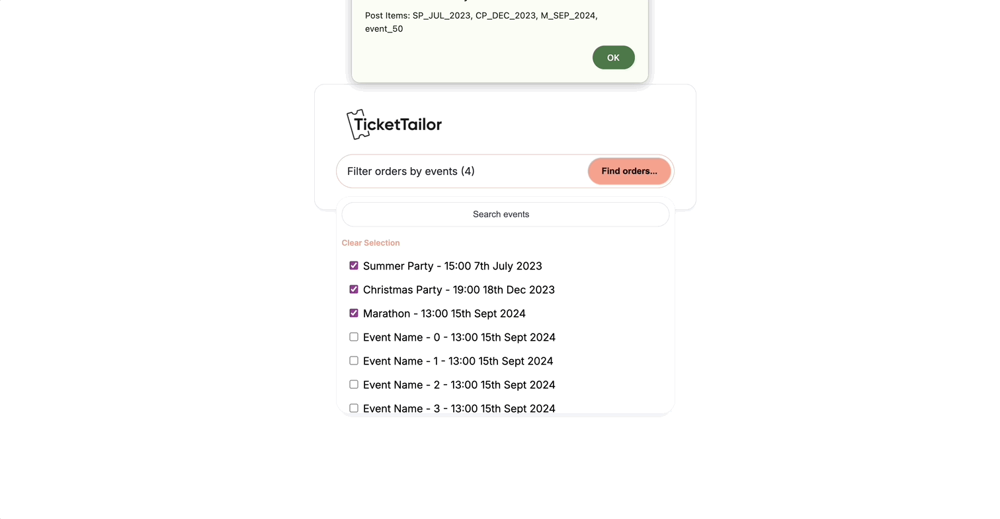

# Ticket Tailor Event Selection

This project provides a user-friendly event selection dropdown designed for Ticket Tailor. It allows event organizers to filter customer orders by selecting one or multiple events from a dropdown menu.

## Features

- Multi-select dropdown to filter events.
- Search functionality to easily locate events in large lists.
- Clear selection button to reset the event selection.
- Submit button that posts selected event IDs as a comma-separated list.
- Optimized for usability and aesthetics with clean, modular code.

## Demo

## Figma Design

Check out the design layout on Figma:

[View on Figma](https://www.figma.com/design/QzRPv9dC8EzbsTaQHYWmN4/Interview?node-id=1-2&t=ZY5YACj99jba7i55-1)

## Getting Started

1. Clone this repository.
2. Open `index.html` in your preferred web browser to view the functionality.

## Technology Used

- **HTML/CSS/JavaScript**: For structure, styling, and interactivity.
- **SCSS**: For modular and maintainable styling.
- **jQuery**: To simplify DOM manipulation and event handling.

## File Structure

- **index.html**: Contains the main structure of the page.
- **css/index.css**: Compiled CSS from SCSS styling.
- **js/index.js**: JavaScript for dropdown functionality.
- **assets/**: Contains images and other assets for the project.

## Notes

This code is intended for demonstration purposes, with a focus on user experience, aesthetics, functionality, and clean code.

---

Thank you for checking out the project!
